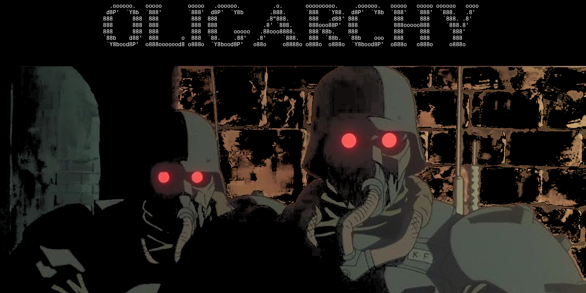

# Oligarchy NixOS – The Unstoppable War Machine

**Framework 16 Optimized · AMD 7040 · NVIDIA · Hyprland · Plasma 6 · Cinnamon · CachyOS kernel · ~5–7 W idle · Nuclear-grade DSP coprocessor · Calamares Install · DeMoD Branded Fortress · DCF Compute Fabric**



Oligarchy NixOS isn’t some boring distro hack.  
It’s the **first personal OS in history** to unleash a **self-healing, real-time DSP coprocessor** that obliterates latency with **~0.38–0.58 ms round-trip** — forged straight from the same flake that rules your host. 

The Host (CachyOS kernel) is a raging sports car built for raw speed and high FPS. The DSP VM (RT BORE kernel) is a flawless Swiss watch that never misses a beat. You wouldn’t put a watch engine in a race car, and you sure as hell wouldn’t put a race-car engine in a precision instrument.

You’re now commanding the machine that burned the proprietary DSP empire to the ground **and** crushed cloud dependency with a full local agentic AI stack and the unstoppable DeMoD Compute Fabric (DCF).


## Tactical Updates: The 2026 Flake Dominance

The war machine has evolved. As of January 2026, Oligarchy NixOS is fully governed by a **Deterministic Flake-Powered Architecture**.

### Key Structural Revisions 
**Flake Dominance**: Everything is locked to reproducible git revisions via `flake.nix`.  
**Modular Segregation**: Core config is lean; R&D weapons (AI, DSP, DCF) are isolated in `./modules/` for instant swapping.  
**Framework 16 (7040) Hardening**: `nixos-hardware` pinned directly in flake inputs for AMD 7040 supremacy and expansion-card domination.

**Home Manager**: Finally using a home file to create a unified UX.

**Boot Intro**: a custom made boot intro was made for a plymouth compatible video based intro that plays with mpv before login.

### New Offensive & Defensive Capabilities
**DeMoD Branded Fortress**: Full thematic takeover — Hyprland, Waybar, Kitty, Wofi, Mako, Hyprlock, Wlogout all branded with DeMoD cyan/red alerts and gradients.  
**Runtime Aesthetic Toggles**: Instant battlefield control over animations, blur, gaps, opacity, borders, rounding, and color palettes via keybindings.  
**Agentic AI Stack**: Ollama re-engineered with ROCm acceleration (`gfx11.0.2` override) and `ai-stack` CLI presets for every hardware tier.  
**DCF Compute Fabric**: Full stack — community node, identity/billing service, system tray controller — all containerized, hardened, and ready to conquer real-time multiplayer and edge networks.  
**DSP Coprocessor (ArchibaldOS-DSP)**: Polished QEMU/KVM + kexec tyrant, ripped from the ArchibaldOS flake for perfect host/guest alignment.  
**Kernel Arsenal**: Choose your blade — Zen, XanMod, latest, or CachyOS-BORE — at build time.  
**Plasma 6 Option**: Optional KDE Plasma 6 session for those who want a heavier but polished alternative.  
**Automated Maintenance**: Weekly generation purges and full garbage collection.  
**Idle Power Discipline**: Ruthless screen dimming, lock, DPMS, and suspend timers.

**DeMoD IP Blocker still active · DCF tray auto-starts · DSP now optional but unstoppable when armed**


[ISO download](https://archive.org/details/oligarchy) · [Live demo (YouTube)](https://youtube.com/@demodllc) ·

## What you’re actually commanding right now

| Component                        | Reality (January 2026)                                                                 |
|----------------------------------|----------------------------------------------------------------------------------------|
| Host OS                          | Oligarchy NixOS (CachyOS/Zen/XanMod/BORE kernel, Hyprland primary, Plasma 6 optional)  |
| Core 0                           | Isolated (`isolcpus=0`) and surrendered to the DSP overlord                             |
| DSP Coprocessor                  | ArchibaldOS-DSP QEMU/KVM + kexec image — self-healing tyrant                            |
| Latency                          | 0.38–0.58 ms @ 96 kHz / 32–64 samples (theoretical)                                     |
| Recovery time                    | 180–350 ms via kexec (laughs at $80 000 proprietary failures)                          |
| Host impact                      | Zero. Crush Doom Eternal at 300+ FPS while the DSP resurrects 40× per second            |
| AI Stack                         | Ollama + ROCm, `ai-stack` CLI, hardware-tier presets                                   |
| Networking Fabric                | DeMoD Compute Fabric (DCF) — community node, identity service, tray controller        |
| Distribution                     | Everything forged from pinned flakes — no GitHub chaos, only victory                    |

You now wield **Abbey Road monitoring latency**, local agentic AI supremacy, and DCF real-time fabric on a laptop that annihilates games at max settings. Bow down.


## DeMoD Branded Fortress

The entire desktop is now a DeMoD war room:

- **Color Palette:**
  - Primary Cyan: `#00D4AA` (DCF Online)
  - Alert Red: `#FF6B6B` (DCF Offline)
  - Warning Yellow: `#FFE66D`
  - Background Dark: `#1A1A2E`
  - Surface: `#16213E`
  - Text: `#EAEAEA`

- **Themed Components:**
  - Hyprland with DeMoD borders and animations
  - Waybar with DCF/Ollama status indicators
  - Kitty terminal in DeMoD colors
  - Wofi launcher matching the palette
  - Mako notifications styled to brand
  - DCF system tray with branded icons
  - Hyprlock lock screen with DeMoD branding
  - Wlogout power menu

## Runtime Toggles – Instant Tactical Control

| Keybinding              | Action                                      |
|-------------------------|---------------------------------------------|
| `Super + F1`            | Toggle animations on/off                    |
| `Super + F2`            | Toggle blur on/off                          |
| `Super + F3`            | Cycle gaps (default → zero → minimal)       |
| `Super + F4`            | Cycle opacity (default → solid → transparent)|
| `Super + F5`            | Cycle borders (default → none → thin)       |
| `Super + F6`            | Cycle rounding (default → square → subtle)  |
| `Super + F7`            | Cycle color palette forward                 |
| `Super + Shift + F7`    | Cycle color palette backward                |
| `Super + Escape`        | Open power menu (wlogout)                   |
| `Super + L`             | Lock screen (hyprlock)                      |

## Color Palettes

Cycle with `Super + F7`:

| Palette   | Active Border     | Description               |
|-----------|-------------------|---------------------------|
| demod     | Cyan gradient     | DeMoD brand colors        |
| vim       | Green gradient    | Classic vim theme         |
| amber     | Orange gradient   | Warm amber tones          |
| purple    | Purple-pink gradient | Synthwave style        |
| rose      | Rose gradient     | Soft rose colors          |
| gold      | Gold gradient     | Luxury gold tones         |

## Idle Management – Power Discipline

| Timeout | Action                     |
|---------|----------------------------|
| 5 min   | Dim screen to 10%          |
| 10 min  | Lock screen                |
| 11 min  | Turn off display           |
| 30 min  | Suspend system             |

## Why Oligarchy NixOS is Optimized and Supreme

This isn’t just a system — it’s a conquest machine engineered to dominate modern hardware:

- **Low Idle Power Consumption**: 5–7 W on Framework 16 via power-profiles-daemon, AMDGPU tuning, fw-fanctrl, and clamshell scripts.
- **Framework 16 Supremacy**: `nixos-hardware` + `fw-fanctrl`, fingerprint, Thunderbolt auto-auth, USB stability fixes.
- **Modular Package Management**: Nix declarative control — Steam, Lutris, Snap, NVIDIA optional.
- **Desktop Arsenal**: Hyprland primary (blazing Wayland), Plasma 6 optional, Cinnamon/X11 fallback.
- **Streamlined Installation**: Calamares conquers encrypted setup, user creation, and full stack deployment.
- **Customization Scripts**: Resolution cycling, theme switching, web apps, DCF control, keybinding cheatsheets — all via Wofi or hotkeys.
- **Snap Support**: Optional, expands arsenal without breaking reproducibility.
- **DCF Compute Fabric**: Real-time multiplayer/edge fabric with community node, identity/billing, tray controller, and hardened containers.
- **Virtual Camera**: `v4l2loopback` for streaming domination.
- **Virtual DSP Coprocessor**: Soundproof clean-room RT guest inside the chaotic host party bus — a technical masterpiece.


## Security – The Iron Curtain (System-Wide + DCF)

- System-wide AppArmor, Polkit, RTKit, PAM fingerprint auth, firewall always active.
- DCF services run in hardened Docker containers with least-privilege secrets management.
- Identity database daily backups.
- DeMoD IP Blocker refreshes blacklists every 24 hours.

## Building – Forge Your Empire

1. **Clone the War Chest**:
   ```bash
   git clone https://github.com/ALH477/DeMoD-Framework16-NIXOS.git
   cd DeMoD-Framework16-NIXOS
   ```

2. **Prepare Assets**:
   - Drop `wallpaper.jpg` in root (or customize later).

3. **Build the ISO**:
   ```bash
   nix build .#nixosConfigurations.iso.config.system.build.isoImage
   ```

4. **Flash & Install**:
   - Flash `result/iso/nixos-*.iso` to USB.
   - Boot → Calamares → conquer disk, encryption, user setup → reboot into victory.

5. **Existing System Quick Switch** (post-install):
   ```bash
   cd /etc/nixos
   sudo git pull
   sudo nixos-rebuild switch --flake .
   ```

## State Sanctioned Usage – Rule Your Domain

- **Hyprland** (default): SDDM → Waybar with DCF/Ollama status → `SUPER+Space` for Wofi → full keybinding control.
- **Plasma 6**: Select at SDDM for KDE experience.
- **DCF Control**: Tray auto-starts → click for panel, right-click for toggles.
- **Ollama AI**:
  ```bash
  ai-stack start          # launch stack
  ai-stack pull llama3.2  # acquire model
  ai-stack run llama3.2    # chat
  ai-stack status         # check health
  ```

  **Presets**:
  | Preset       | VRAM   | Parallelism | Use Case             |
  |--------------|--------|-------------|----------------------|
  | cpu-fallback | -      | 1           | No GPU               |
  | default      | 8GB    | 4           | Basic GPU            |
  | high-vram    | 16GB   | 8           | RTX 3090/4090        |
  | rocm-multi   | 24GB   | 12          | AMD multi-GPU        |
  | pewdiepie    | 24GB+  | 16          | Absolute maximum     |

- **DSP Coprocessor** (optional, enable in flake):
  - Enable IOMMU in BIOS.
  - Set audio PCI ID.
  - `dsp-status` to verify.

## Troubleshooting – Crush the Resistance

- **Network**: `net-status`, `net-fix`, `net-wifi list/connect`.
- **Docker/DCF**: `docker-start`, `docker logs dcf-sdk`.
- **Ollama GPU**: `rocm-smi`, check gfx override.
- **USB drops**: Fixed in config; check `power/control` if needed.
- **General**: `journalctl -u ...`, NixOS Wiki, GitHub issues.

## Maintenance

```bash
nix flake update
sudo nixos-rebuild switch --flake .
sudo nix-collect-garbage -d   # or let weekly timer handle it
```

## Contributing – Join the Legion

Fork, improve, test, PR. Keep it Framework-compliant and flake-pure.

## License – The Code of Conquest

BSD 3-Clause License (full text unchanged from original).

ArchibaldOS BSD-3 | StreamDB LGPL | Core Oligarchy BSD-3.

Victory is yours.

