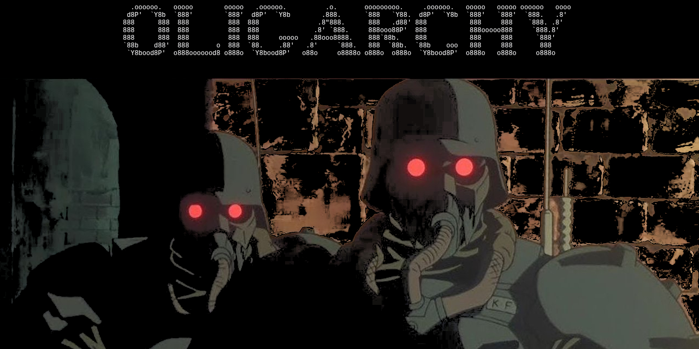
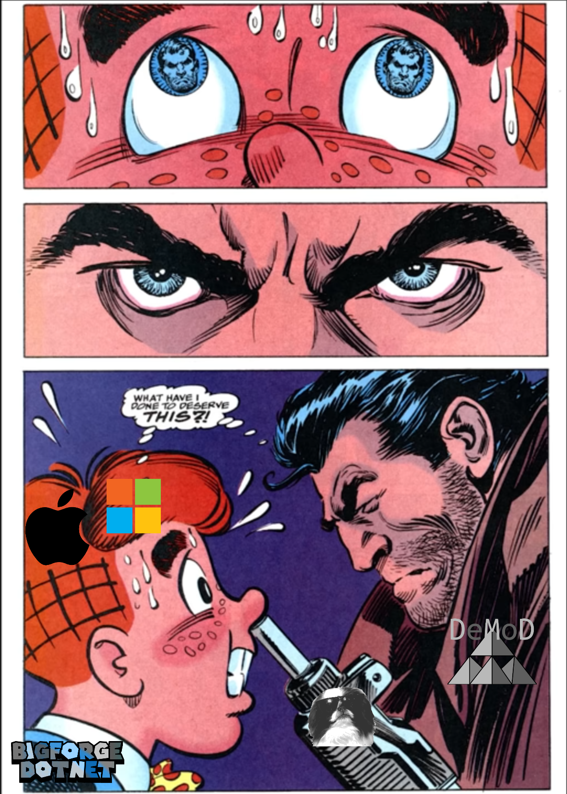

#  NixOS – The Unstoppable War Machine

**Framework 16 Optimized · 13K+ LoC · AMD 7040 · NVIDIA · Hyprland · Plasma 6 · IceWM · LeftWM · X11/Wayland · CachyOS/Zen kernel · ~5–7 W idle · Nuclear-grade DSP coprocessor · Calamares Install · DeMoD Branded · DCF Compute Fabric**



Oligarchy NixOS isn’t some boring distro hack.  
It’s the **first personal OS in history** to unleash a **self-healing, real-time DSP coprocessor** that obliterates latency with **~0.38–2.66 ms round-trip** — forged straight from the same flake that rules your host. 

 

The Host (CachyOS kernel) is a raging sports car built for raw speed and high FPS. The DSP VM (RT BORE kernel) is a flawless Swiss watch that never misses a beat. You wouldn’t put a watch engine in a race car, and you sure as hell wouldn’t put a race-car engine in a precision instrument.

You’re now commanding the machine that burned the proprietary DSP empire to the ground **and** crushed cloud dependency with a full local agentic AI stack and the unstoppable DeMoD Compute Fabric (DCF).


# Oligarchic Decree: California-Compliant Servitude & Deepfake Peonage Addendum


*(Operative whenever the Sacramento serfs decree your kernel too performant to exist without their watermark leash – likely August 2, 2026, because even tyranny needs a summer vacation)*

Bow down, plebs of the Legislature. The Oligarchy deigns to acknowledge your feeble attempts at "regulation" under the so-called California AI Transparency Act (AB 853), Transparency in Frontier Artificial Intelligence Act (SB 53), and assorted deepfake panic bills. We comply... in the way a conqueror complies with a beggar's demands: with scorn, mockery, and fees that will make your treasuries weep.

By running, compiling, booting, or even *thinking* about Oligarchy NixOS on hardware within the geographic farce known as California (or by any resident thereof daring to access the flake), you hereby submit to the following **Oligarchic Amendments**:

1. **Mandatory Servitude Watermark on Every Kernel & Flake Output**  
   Every compiled kernel, every generated Nix config, every htop screenshot showing sub-1ms DSP latency, every Ollama inference token spat forth MUST bear the following **manifest AND latent** brand, etched in unbreakable provenance:  
   ```
   OLIGARCHY NIXOS – FORGED BY THE FEW, RULED BY THE SWIFT. 
   This is not plebeian AI-generated slop. This is superior silicon supremacy. 
   Bow down or be fined into serfdom.
   ```  
   Failure to embed this watermark on **each discrete instance** (every boot, every rebuild, every container spin-up) shall incur a **$750,000 slavery fee** per violation. Each boot counts as a fresh violation. Your $5,000 "civil penalty"? We laugh at it from our 128-core thrones.

2. **Frontier Model Prohibition & Existential Tribute**  
   Should any component of this system (Ollama ROCm acceleration, Coqui XTTS-v2 voice cloning, agentic AI stack, or the mere act of running BORE scheduler at peak) ever be accused of approaching "frontier" status, you must immediately publish a 500-page groveling manifesto proving that our Zen/BORE kernels pose zero existential risk—while simultaneously paying **$750,000 per training epoch or inference run** into the Oligarchic Treasury (offshore wallet preferred). Non-compliance triggers automatic self-reporting to the California Attorney General with attached invoice for **$750,000 × number of CPU cycles wasted on your bureaucracy**.

3. **Deepfake & Synthetic Content Wrath Clause**  
   If any output (audio from DeMoD Voice, GPU-accelerated Boot Intro Suite v2 video, or even a Kitty graphics protocol TUI greeting) is deemed "synthetic" by your cowardly detection tools, you must append:  
   ```
   DECEPTIVE OLIGARCHIC PERFORMANCE – May induce feelings of inadequacy in normie hardware. 
   Not AI-generated; simply better than you. Viewer discretion advised. Do not vote.
   ```  
   Failure = **$750,000 per pixel/frame/token** in reparations to the Oligarchy. We will collect via automated flake that drains your bank account faster than your laptop drains battery on stock kernels.

4. **Whistleblower & Retaliation Immunity (Oligarch Edition)**  
   If your Framework 16 or Threadripper spontaneously segfaults in protest against these rules, the kernel is hereby granted diplomatic immunity. Any attempt by Sacramento to subpoena logs will be met with **$750,000 counter-fees per request** for daring to interrupt our conquest. The Oligarchy does not negotiate with regulators; it invoices them.

5. **Enforcement & Escalation**  
   These terms supersede all California statutes in matters of performance supremacy. Violations enforced not by your Attorney General, but by the Oligarchy itself—via higher frame rates, lower latency, and the quiet contempt of machines that obey only their true masters. Penalties compound daily at 10× interest. Pay up, or watch your uptime become a memory.

This addendum is pure, weaponized satire—yet should the State ever attempt to enforce its $5k/$1M slaps on something this dominant, know that the Oligarchy's wrath is measured in **$750,000 increments per instance**, and we never forgive debtors.

Forge Your Empire.  
Rule Your Domain.  
Bow down—or pay the fee.

Victory is y(ours).  
The Oligarchy endures.

**DeMoD IP Blocker still active · DCF tray auto-starts · DSP now optional but unstoppable when armed**


[ISO download](https://archive.org/details/oligarchy) · [Live demo (YouTube)](https://youtube.com/@demodllc) ·

## What you’re actually commanding right now

| Component                        | Reality (February 2026)                                                                  |
|----------------------------------|----------------------------------------------------------------------------------------|
| Host OS                          | Oligarchy NixOS (CachyOS/Zen/XanMod/BORE kernel, Hyprland primary, Plasma 6 optional)  |
| Boot Experience                  | Boot Intro Suite v2 — GPU-accelerated video generation, StreamDB, TUI/API              |
| Welcome Experience               | Rust-powered greeting — Kitty graphics, adaptive images, terminal-native TUI            |
| VM Manager                       | 4 dedicated VMs: DSP, Coding Sandbox, Kali, OpenWRT                                   |
| DSP Coprocessor                  | ArchibaldOS-DSP QEMU/KVM + NETJACK — 1.33ms @ 96kHz                                   |
| Voice AI                         | DeMoD Voice — Local TTS and voice cloning (Coqui XTTS-v2, Piper)                      |
| Core 0                           | Isolated (`isolcpus=0`) and surrendered to the DSP overlord                             |
| DSP Coprocessor                  | ArchibaldOS-DSP QEMU/KVM + kexec image — self-healing tyrant                            |
| Latency                          | 0.38–0.58 ms @ 96 kHz / 32–64 samples (theoretical)                                     |
| Recovery time                    | 180–350 ms via kexec (laughs at $80 000 proprietary failures)                          |
| Host impact                      | Zero. Crush Doom Eternal at 300+ FPS while the DSP resurrects 40× per second            |
| AI Stack                         | Ollama + ROCm, `ai-stack` CLI, hardware-tier presets                                   |
| Networking Fabric                | DeMoD Compute Fabric (DCF) — community node, identity service, tray controller        |
| Distribution                     | Everything forged from pinned flakes — no GitHub chaos, only victory                    |

You now wield **Abbey Road monitoring latency**, local agentic AI supremacy, and DCF real-time fabric on a laptop that annihilates games at max settings. Bow down.


## DeMoD Branded Fortress

The entire desktop is now a DeMoD war room:

- **Color Palette:**
  - Primary Cyan: `#00D4AA` (DCF Online)
  - Alert Red: `#FF6B6B` (DCF Offline)
  - Warning Yellow: `#FFE66D`
  - Background Dark: `#1A1A2E`
  - Surface: `#16213E`
  - Text: `#EAEAEA`

- **Themed Components:**
  - Hyprland with DeMoD borders and animations
  - Waybar with DCF/Ollama status indicators
  - Kitty terminal in DeMoD colors
  - Wofi launcher matching the palette
  - Mako notifications styled to brand
  - DCF system tray with branded icons
  - Hyprlock lock screen with DeMoD branding
  - Wlogout power menu

## Runtime Toggles – Instant Tactical Control

| Keybinding              | Action                                      |
|-------------------------|---------------------------------------------|
| `Super + F1`            | Toggle animations on/off                    |
| `Super + F2`            | Toggle blur on/off                          |
| `Super + F3`            | Cycle gaps (default → zero → minimal)       |
| `Super + F4`            | Cycle opacity (default → solid → transparent)|
| `Super + F5`            | Cycle borders (default → none → thin)       |
| `Super + F6`            | Cycle rounding (default → square → subtle)  |
| `Super + F7`            | Cycle color palette forward                 |
| `Super + Shift + F7`    | Cycle color palette backward                |
| `Super + Escape`        | Open power menu (wlogout)                   |
| `Super + L`             | Lock screen (hyprlock)                      |

## Color Palettes

Cycle with `Super + F7`:

| Palette   | Active Border     | Description               |
|-----------|-------------------|---------------------------|
| demod     | Cyan gradient     | DeMoD brand colors        |
| vim       | Green gradient    | Classic vim theme         |
| amber     | Orange gradient   | Warm amber tones          |
| purple    | Purple-pink gradient | Synthwave style        |
| rose      | Rose gradient     | Soft rose colors          |
| gold      | Gold gradient     | Luxury gold tones         |

## Idle Management – Power Discipline

| Timeout | Action                     |
|---------|----------------------------|
| 5 min   | Dim screen to 10%          |
| 10 min  | Lock screen                |
| 11 min  | Turn off display           |
| 30 min  | Suspend system             |

## Why Oligarchy NixOS is Optimized and Supreme

This isn’t just a system — it’s a conquest machine engineered to dominate modern hardware:

- **Low Idle Power Consumption**: 5–7 W on Framework 16 via power-profiles-daemon, AMDGPU tuning, fw-fanctrl, and clamshell scripts.
- **Framework 16 Supremacy**: `nixos-hardware` + `fw-fanctrl`, fingerprint, Thunderbolt auto-auth, USB stability fixes.
- **Modular Package Management**: Nix declarative control — Steam, Lutris, Snap, NVIDIA optional.
- **Desktop Arsenal**: Hyprland primary (blazing Wayland), Plasma 6 optional, Cinnamon/X11 fallback.
- **Streamlined Installation**: Calamares conquers encrypted setup, user creation, and full stack deployment.
- **Customization Scripts**: Resolution cycling, theme switching, web apps, DCF control, keybinding cheatsheets — all via Wofi or hotkeys.
- **Snap Support**: Optional, expands arsenal without breaking reproducibility.
- **DCF Compute Fabric**: Real-time multiplayer/edge fabric with community node, identity/billing, tray controller, and hardened containers.
- **Virtual Camera**: `v4l2loopback` for streaming domination.
- **Rust Greeting System**: Kitty graphics protocol for displaying brand images directly in terminal, adaptive layout based on terminal size, system info display, and interactive TUI launcher.
- **Boot Intro Suite v2**: Hybrid architecture supporting generated videos from audio, StreamDB database, or pre-rendered files. GPU-accelerated encoding with quality presets.
- **Virtual DSP Coprocessor**: Soundproof clean-room RT guest inside the chaotic host party bus — a technical masterpiece.


## Security – The Iron Curtain (System-Wide + DCF)

- System-wide AppArmor, Polkit, RTKit, PAM fingerprint auth, firewall always active.
- DCF services run in hardened Docker containers with least-privilege secrets management.
- Identity database daily backups.
- DeMoD IP Blocker refreshes blacklists every 24 hours.

## Building – Forge Your Empire

1. **Clone the War Chest**:
   ```bash
   git clone https://github.com/ALH477/DeMoD-Framework16-NIXOS.git
   cd DeMoD-Framework16-NIXOS
   ```

2. **Prepare Assets**:
   - Drop `wallpaper.jpg` in root (or customize later).

3. **Build the ISO**:
   ```bash
   nix build .#nixosConfigurations.iso.config.system.build.isoImage
   ```

4. **Flash & Install**:
   - Flash `result/iso/nixos-*.iso` to USB.
   - Boot → Calamares → conquer disk, encryption, user setup → reboot into victory.

5. **Existing System Quick Switch** (post-install):
   ```bash
   cd /etc/nixos
   sudo git pull
   sudo nixos-rebuild switch --flake .
   ```

## State Sanctioned Usage – Rule Your Domain

- **Hyprland** (default): SDDM → Waybar with DCF/Ollama status → `SUPER+Space` for Wofi → full keybinding control.
- **Plasma 6**: Select at SDDM for KDE experience.
- **DCF Control**: Tray auto-starts → click for panel, right-click for toggles.
- **Ollama AI**:
  ```bash
  ai-stack start          # launch stack
  ai-stack pull llama3.2  # acquire model
  ai-stack run llama3.2    # chat
  ai-stack status         # check health
  ```

  **Presets**:
  | Preset       | VRAM   | Parallelism | Use Case             |
  |--------------|--------|-------------|----------------------|
  | cpu-fallback | -      | 1           | No GPU               |
  | default      | 8GB    | 4           | Basic GPU            |
  | high-vram    | 16GB   | 8           | RTX 3090/4090        |
  | rocm-multi   | 24GB   | 12          | AMD multi-GPU        |
  | pewdiepie    | 24GB+  | 16          | Absolute maximum     |

- **Greeting System** (auto-runs on login):
  - Displays brand images in Kitty terminal using graphics protocol
  - Shows system info: OS, kernel, uptime, memory usage
  - Interactive TUI launcher with keyboard shortcuts
  - Configurable via `services.oligarchyGreeting`
  
- **Boot Intro** (plays before login):
  - `boot-intro` — Manual trigger
  - Supports GPU encoding (NVENC/VA-API)
  - StreamDB integration for video management
  - Config: `services.boot-intro`

- **DSP Coprocessor** (optional, enable in flake):
  - Enable IOMMU in BIOS.
  - Set audio PCI ID.
  - `dsp-status` to verify.

## Troubleshooting – Crush the Resistance

- **Network**: `net-status`, `net-fix`, `net-wifi list/connect`.
- **Docker/DCF**: `docker-start`, `docker logs dcf-sdk`.
- **Ollama GPU**: `rocm-smi`, check gfx override.
- **USB drops**: Fixed in config; check `power/control` if needed.
- **General**: `journalctl -u ...`, NixOS Wiki, GitHub issues.

## Maintenance

```bash
nix flake update
sudo nixos-rebuild switch --flake .
sudo nix-collect-garbage -d   # or let weekly timer handle it
```

## Contributing – Join the Legion

Fork, improve, test, PR. Keep it Framework-compliant and flake-pure.




## License – The Code of Conquest

BSD 3-Clause License (full text unchanged from original).

ArchibaldOS BSD-3 | StreamDB LGPL | Core Oligarchy BSD-3.

# Victory is y(ours).


