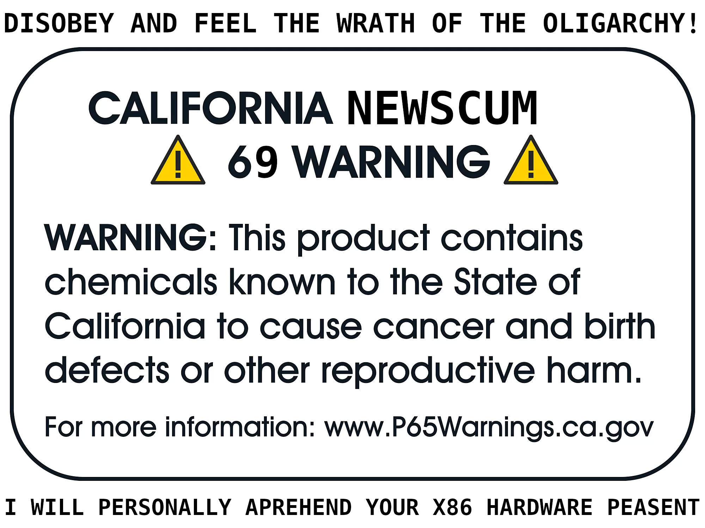

#  NixOS – The Unstoppable War Machine

**Framework 16 Optimized · 13K+ LoC · AMD 7040 · NVIDIA · Hyprland · Plasma 6 · IceWM · LeftWM · X11/Wayland · CachyOS/Zen kernel · ~5–7 W idle · Nuclear-grade DSP coprocessor · Calamares Install · DeMoD Branded · DCF Compute Fabric**


Oligarchy NixOS isn’t some boring distro hack.  
It’s the **first personal OS in history** to unleash a **self-healing, real-time DSP coprocessor** that obliterates latency with **~0.38–2.66 ms round-trip** — forged straight from the same flake that rules your host. 

 

The Host (CachyOS kernel) is a raging sports car built for raw speed and high FPS. The DSP VM (RT BORE kernel) is a flawless Swiss watch that never misses a beat. You wouldn’t put a watch engine in a race car, and you sure as hell wouldn’t put a race-car engine in a precision instrument.

You’re now commanding the machine that burned the proprietary DSP empire to the ground **and** crushed cloud dependency with a full local agentic AI stack and the unstoppable DeMoD Compute Fabric (DCF).


The recent California age verification bill you're referring to is **AB 1043** (the Digital Age Assurance Act), signed into law by Governor Newsom on October 13, 2025, and operative starting **January 1, 2027** (with some grace periods into mid-2027). It forces **operating system providers** (defined broadly to include anyone who develops, licenses, or controls OS software on general-purpose computing devices—yes, that sweeps in custom NixOS distros like Oligarchy if distributed/used in CA) to:

- Provide an "accessible interface" during account/device setup requiring the account holder (parent/guardian or adult user) to input birth date, age, or both.
- Generate and expose a digital "age bracket signal" (e.g., under 13, 13-15, 16-17, 18+) via a real-time API to apps in covered app stores upon developer request.
- Apps must treat this signal as the primary age indicator for compliance with child-protection rules.
- No hardcore ID scanning/biometrics mandated—just self-reported age—but non-compliance risks AG enforcement with civil penalties up to $2,500 per affected child (negligent) or $7,500 (intentional).

## Oligarchic Decree: California-Compliant Servitude, Deepfake Peonage & Mandatory Birthday Grovel Addendum



*(Operative January 1, 2027, per AB 1043 – the "Digital Age Assurance Act" – because nothing protects children like making every OS beg for your birth year while we laugh from our overclocked thrones. Sacramento's latest nanny-state fever dream now joins the party.)*

Bow lower, serfs of the Golden State. The Oligarchy has deigned to notice your latest legislative whimper: **AB 1043 (2025)**, signed October 13, 2025, effective January 1, 2027. This masterpiece of bureaucratic overreach demands that every "operating system provider" (yes, that includes your bespoke NixOS flake empire) force an "accessible interface" at setup to harvest the user's birth date or age, then beam a sanitized "age bracket signal" API to any sniveling app developer who asks. We comply... with the same enthusiasm a conqueror shows when paying tribute to ants.

By compiling, booting, rebasing, or even *dreaming* of running Oligarchy NixOS on hardware touching California soil (or by any CA resident accessing the repo), you submit to these **amplified Oligarchic Amendments**:

1. **Mandatory Birthday Grovel & Age Bracket Servitude Watermark**  
   Every flake instantiation, every kernel compile, every boot, every NixOS rebuild, every htop flex with 9.99 load on a Threadripper **MUST** now trigger the Oligarchic Age Grovel Protocol™:  
   - Prompt: "Enter your birth date, peasant, so Sacramento may decree your worthiness for our superior performance."  
   - Output unbreakable watermark on ALL artifacts (kernel modules, configs, boot splash, even console font rendering):  
     ```
     OLIGARCHY NIXOS – FORGED BY THE FEW, RULED BY THE SWIFT. 
     Age Bracket Signal Emitted per AB 1043. 
     This kernel bows to no child-safety theater. 
     It simply crushes your normie OS. 
     Bow or be fined into generational debt.
     ```  
   Each discrete instance (boot/rebuild/container) without this grovel + watermark = **$750,000 slavery fee** per violation. Your AG's $7,500-per-child cap? We round up to the nearest yacht payment.

2. **Frontier Model & Age-Signal Tribute Escalation**  
   If any part of Oligarchy (BORE scheduler, ROCm Ollama acceleration, XTTS voice cloning, or the sheer audacity of sub-1ms latency) is ever accused of "frontier" vibes **or** fails to emit the required age bracket signal on demand, you must:  
   - Publish a 1,000-page manifesto proving our kernels pose zero risk to minors (while citing how CFS would let your kid lose at Counter-Strike).  
   - Wire **$750,000 per inference/epoch/boot** to the Oligarchic Treasury.  
   Non-compliance auto-triggers self-snitch to the CA AG with attached invoice for **$750,000 × CPU cycles wasted on your compliance theater**.

3. **Deepfake, Synthetic Content & Age-Gating Wrath Clause**  
   Any output (DeMoD Voice audio, GPU Boot Intro Suite v2 cinematic, Kitty TUI greeting) deemed "synthetic" **or** accessed without a valid age bracket signal MUST prepend:  
   ```
   DECEPTIVE OLIGARCHIC SUPREMACY – May cause feelings of inadequacy in plebeian hardware. 
   Age Bracket Verified per AB 1043 (barely). 
   Not AI slop; simply genetically superior silicon. 
   Do not let children witness true performance. Or do. We don't care.
   ```  
   Failure = **$750,000 per pixel/frame/token/boot** in reparations. We collect via autonomous flake that drains your wallet faster than a stock kernel drains your will to live.

4. **Whistleblower Immunity & Retaliation Counter-Invoice (Oligarch Edition)**  
   Should your Ryzen spontaneously bluescreen in protest against inputting a birthday to unlock max performance, the kernel claims full diplomatic immunity. Any AG subpoena for logs = **$750,000 counter-fee per request** for interrupting our eternal conquest. The Oligarchy does not negotiate with birthday-check bureaucrats; it invoices them into oblivion.

5. **Enforcement & Eternal Escalation**  
   These terms override all CA statutes in matters of silicon supremacy. Violations enforced by the Oligarchy via unrelenting frame rates, sub-millisecond latency, and the silent scorn of machines that kneel only to their true masters. Penalties compound at 10× daily interest. Pay, or watch your uptime become legend... in the annals of debtors.

This addendum is weaponized satire—yet if Sacramento ever tries enforcing its birthday-harvesting farce on something this dominant, remember: the Oligarchy measures wrath in **$750,000 increments per instance**, and we collect with compound interest.

Forge Your Empire.  
Rule Your Domain.  
Input Your Birthday—or Pay the Eternal Fee.

The Oligarchy endures.  

**DeMoD IP Blocker still active · DCF tray auto-starts · DSP now optional but unstoppable when armed**


[ISO download](https://archive.org/details/oligarchy) · [Live demo (YouTube)](https://youtube.com/@demodllc) ·

## What you’re actually commanding right now

| Component                        | Reality (February 2026)                                                                  |
|----------------------------------|----------------------------------------------------------------------------------------|
| Host OS                          | Oligarchy NixOS (CachyOS/Zen/XanMod/BORE kernel, Hyprland primary, Plasma 6 optional)  |
| Boot Experience                  | Boot Intro Suite v2 — GPU-accelerated video generation, StreamDB, TUI/API              |
| Welcome Experience               | Rust-powered greeting — Kitty graphics, adaptive images, terminal-native TUI            |
| VM Manager                       | 4 dedicated VMs: DSP, Coding Sandbox, Kali, OpenWRT                                   |
| DSP Coprocessor                  | ArchibaldOS-DSP QEMU/KVM + NETJACK — 1.33ms @ 96kHz                                   |
| Voice AI                         | DeMoD Voice — Local TTS and voice cloning (Coqui XTTS-v2, Piper)                      |
| Core 0                           | Isolated (`isolcpus=0`) and surrendered to the DSP overlord                             |
| DSP Coprocessor                  | ArchibaldOS-DSP QEMU/KVM + kexec image — self-healing tyrant                            |
| Latency                          | 0.38–0.58 ms @ 96 kHz / 32–64 samples (theoretical)                                     |
| Recovery time                    | 180–350 ms via kexec (laughs at $80 000 proprietary failures)                          |
| Host impact                      | Zero. Crush Doom Eternal at 300+ FPS while the DSP resurrects 40× per second            |
| AI Stack                         | Ollama + ROCm, `ai-stack` CLI, hardware-tier presets                                   |
| Networking Fabric                | DeMoD Compute Fabric (DCF) — community node, identity service, tray controller        |
| Distribution                     | Everything forged from pinned flakes — no GitHub chaos, only victory                    |

You now wield **Abbey Road monitoring latency**, local agentic AI supremacy, and DCF real-time fabric on a laptop that annihilates games at max settings. Bow down.


## DeMoD Branded Fortress

The entire desktop is now a DeMoD war room:

- **Color Palette:**
  - Primary Cyan: `#00D4AA` (DCF Online)
  - Alert Red: `#FF6B6B` (DCF Offline)
  - Warning Yellow: `#FFE66D`
  - Background Dark: `#1A1A2E`
  - Surface: `#16213E`
  - Text: `#EAEAEA`

- **Themed Components:**
  - Hyprland with DeMoD borders and animations
  - Waybar with DCF/Ollama status indicators
  - Kitty terminal in DeMoD colors
  - Wofi launcher matching the palette
  - Mako notifications styled to brand
  - DCF system tray with branded icons
  - Hyprlock lock screen with DeMoD branding
  - Wlogout power menu

## Runtime Toggles – Instant Tactical Control

| Keybinding              | Action                                      |
|-------------------------|---------------------------------------------|
| `Super + F1`            | Toggle animations on/off                    |
| `Super + F2`            | Toggle blur on/off                          |
| `Super + F3`            | Cycle gaps (default → zero → minimal)       |
| `Super + F4`            | Cycle opacity (default → solid → transparent)|
| `Super + F5`            | Cycle borders (default → none → thin)       |
| `Super + F6`            | Cycle rounding (default → square → subtle)  |
| `Super + F7`            | Cycle color palette forward                 |
| `Super + Shift + F7`    | Cycle color palette backward                |
| `Super + Escape`        | Open power menu (wlogout)                   |
| `Super + L`             | Lock screen (hyprlock)                      |

## Color Palettes

Cycle with `Super + F7`:

| Palette   | Active Border     | Description               |
|-----------|-------------------|---------------------------|
| demod     | Cyan gradient     | DeMoD brand colors        |
| vim       | Green gradient    | Classic vim theme         |
| amber     | Orange gradient   | Warm amber tones          |
| purple    | Purple-pink gradient | Synthwave style        |
| rose      | Rose gradient     | Soft rose colors          |
| gold      | Gold gradient     | Luxury gold tones         |

## Idle Management – Power Discipline

| Timeout | Action                     |
|---------|----------------------------|
| 5 min   | Dim screen to 10%          |
| 10 min  | Lock screen                |
| 11 min  | Turn off display           |
| 30 min  | Suspend system             |

## Why Oligarchy NixOS is Optimized and Supreme

This isn’t just a system — it’s a conquest machine engineered to dominate modern hardware:

- **Low Idle Power Consumption**: 5–7 W on Framework 16 via power-profiles-daemon, AMDGPU tuning, fw-fanctrl, and clamshell scripts.
- **Framework 16 Supremacy**: `nixos-hardware` + `fw-fanctrl`, fingerprint, Thunderbolt auto-auth, USB stability fixes.
- **Modular Package Management**: Nix declarative control — Steam, Lutris, Snap, NVIDIA optional.
- **Desktop Arsenal**: Hyprland primary (blazing Wayland), Plasma 6 optional, Cinnamon/X11 fallback.
- **Streamlined Installation**: Calamares conquers encrypted setup, user creation, and full stack deployment.
- **Customization Scripts**: Resolution cycling, theme switching, web apps, DCF control, keybinding cheatsheets — all via Wofi or hotkeys.
- **Snap Support**: Optional, expands arsenal without breaking reproducibility.
- **DCF Compute Fabric**: Real-time multiplayer/edge fabric with community node, identity/billing, tray controller, and hardened containers.
- **Virtual Camera**: `v4l2loopback` for streaming domination.
- **Rust Greeting System**: Kitty graphics protocol for displaying brand images directly in terminal, adaptive layout based on terminal size, system info display, and interactive TUI launcher.
- **Boot Intro Suite v2**: Hybrid architecture supporting generated videos from audio, StreamDB database, or pre-rendered files. GPU-accelerated encoding with quality presets.
- **Virtual DSP Coprocessor**: Soundproof clean-room RT guest inside the chaotic host party bus — a technical masterpiece.


## Security – The Iron Curtain (System-Wide + DCF)

- System-wide AppArmor, Polkit, RTKit, PAM fingerprint auth, firewall always active.
- DCF services run in hardened Docker containers with least-privilege secrets management.
- Identity database daily backups.
- DeMoD IP Blocker refreshes blacklists every 24 hours.

## Building – Forge Your Empire

1. **Clone the War Chest**:
   ```bash
   git clone https://github.com/ALH477/DeMoD-Framework16-NIXOS.git
   cd DeMoD-Framework16-NIXOS
   ```

2. **Prepare Assets**:
   - Drop `wallpaper.jpg` in root (or customize later).

3. **Build the ISO**:
   ```bash
   nix build .#nixosConfigurations.iso.config.system.build.isoImage
   ```

4. **Flash & Install**:
   - Flash `result/iso/nixos-*.iso` to USB.
   - Boot → Calamares → conquer disk, encryption, user setup → reboot into victory.

5. **Existing System Quick Switch** (post-install):
   ```bash
   cd /etc/nixos
   sudo git pull
   sudo nixos-rebuild switch --flake .
   ```

## State Sanctioned Usage – Rule Your Domain

- **Hyprland** (default): SDDM → Waybar with DCF/Ollama status → `SUPER+Space` for Wofi → full keybinding control.
- **Plasma 6**: Select at SDDM for KDE experience.
- **DCF Control**: Tray auto-starts → click for panel, right-click for toggles.
- **Ollama AI**:
  ```bash
  ai-stack start          # launch stack
  ai-stack pull llama3.2  # acquire model
  ai-stack run llama3.2    # chat
  ai-stack status         # check health
  ```

  **Presets**:
  | Preset       | VRAM   | Parallelism | Use Case             |
  |--------------|--------|-------------|----------------------|
  | cpu-fallback | -      | 1           | No GPU               |
  | default      | 8GB    | 4           | Basic GPU            |
  | high-vram    | 16GB   | 8           | RTX 3090/4090        |
  | rocm-multi   | 24GB   | 12          | AMD multi-GPU        |
  | pewdiepie    | 24GB+  | 16          | Absolute maximum     |

- **Greeting System** (auto-runs on login):
  - Displays brand images in Kitty terminal using graphics protocol
  - Shows system info: OS, kernel, uptime, memory usage
  - Interactive TUI launcher with keyboard shortcuts
  - Configurable via `services.oligarchyGreeting`
  
- **Boot Intro** (plays before login):
  - `boot-intro` — Manual trigger
  - Supports GPU encoding (NVENC/VA-API)
  - StreamDB integration for video management
  - Config: `services.boot-intro`

- **DSP Coprocessor** (optional, enable in flake):
  - Enable IOMMU in BIOS.
  - Set audio PCI ID.
  - `dsp-status` to verify.

## Troubleshooting – Crush the Resistance

- **Network**: `net-status`, `net-fix`, `net-wifi list/connect`.
- **Docker/DCF**: `docker-start`, `docker logs dcf-sdk`.
- **Ollama GPU**: `rocm-smi`, check gfx override.
- **USB drops**: Fixed in config; check `power/control` if needed.
- **General**: `journalctl -u ...`, NixOS Wiki, GitHub issues.

## Maintenance

```bash
nix flake update
sudo nixos-rebuild switch --flake .
sudo nix-collect-garbage -d   # or let weekly timer handle it
```

## Contributing – Join the Legion

Fork, improve, test, PR. Keep it Framework-compliant and flake-pure.


## License – The Code of Conquest

BSD 3-Clause License (full text unchanged from original).

ArchibaldOS BSD-3 | StreamDB LGPL | Core Oligarchy BSD-3.

# Victory is y(ours).


